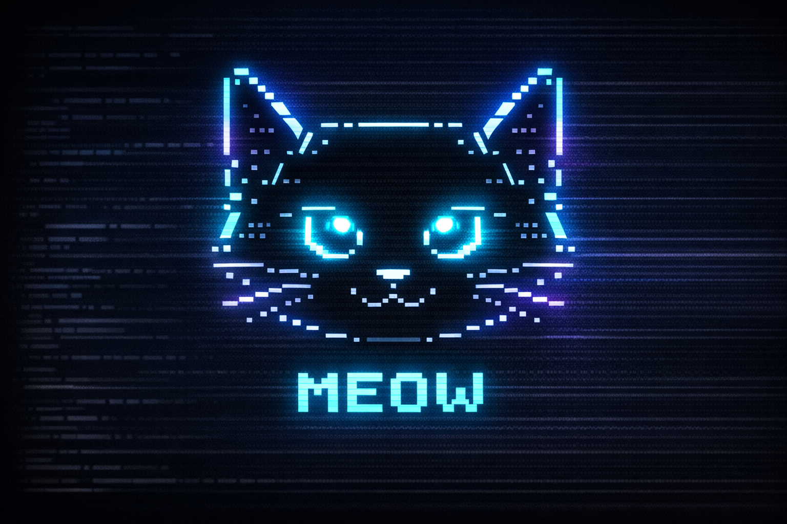

<p align="center">
  
</p>

<h1 align="center">Meow</h1>

<p align="center">
  <strong>Your self-hosted AI personal assistant that lives on your server.</strong><br>
  Memory, personality, scheduled tasks, Discord — all yours.
</p>

<p align="center">
  
  
  
  
</p>

---

## What is Meow?

Meow is an **always-on AI assistant** you self-host on your own server. It has persistent memory, a tamagotchi-like personality, scheduled autonomous tasks, and connects to Discord, email, and X/Twitter.

No cloud. No subscriptions. Your data stays on your machine.

```
  /\_/\
 ( o.o )  "ricordami di controllare le email alle 9"
  > ^ <   =^.^= Task scheduled! Next trigger: in 14 hours
```

## Features

- **Agentic Loop** — AI decides which tools to call, up to 10 steps per turn
- **Persistent Memory** — 2-layer system: curated MEMORY.md + daily append-only notes
- **Hybrid Search** — SQLite FTS5 + vector similarity (sqlite-vec) for finding memories
- **Soul System** — Tamagotchi personality that evolves with you (SOUL.md)
- **Scheduled Tasks** — Cron jobs that run the full agent: fetch news, check email, monitor X
- **Smart Model Selection** — Auto-detects API keys, picks best model per tier (fast/smart/pro)
- **Modular Skills** — Drop `.md` files in `data/skills/` to teach new capabilities
- **Discord Bot** — Slash commands: `/ask`, `/status`, `/jobs`, `/memory`
- **Multi-Provider** — OpenRouter, OpenAI, Anthropic, Moonshot, Together AI
- **CLI with ASCII Cat** — Animated terminal interface with tool-use indicators

## Quick Start

```bash
# Clone
git clone https://github.com/AlekDob/meow.git
cd meow

# Install dependencies
bun install

# Configure
cp .env.example .env
# Edit .env — set at least one API key

# Run
bun run dev
```

On first launch, Meow runs an onboarding flow to learn your name and preferences, then creates a unique personality in `data/soul/SOUL.md`.

## Configuration

Set at least one API key in `.env`:

```env
# Pick one (or more) provider
OPENROUTER_API_KEY=sk-or-v1-...   # Cheapest, most models
OPENAI_API_KEY=sk-...              # Direct OpenAI
MOONSHOT_API_KEY=sk-...            # Kimi K2
TOGETHER_API_KEY=sk-...            # Together AI

# Optional: force a model tier
MODEL_PRESET=smart                 # fast | smart | pro

# Optional: Discord bot
DISCORD_TOKEN=...
DISCORD_CLIENT_ID=...
```

Use `/models` in the CLI to see available models, `/model <name>` to switch.

## Architecture

```
src/
├── agent/          # Core agent loop, system prompt, memory flush
├── cli/            # Terminal UI (ASCII cat, commands, input loop)
├── tools/          # web-fetch, file-read/write, email, X/Twitter, scheduler
├── memory/         # 2-layer store + SQLite FTS5/vector indexer
├── scheduler/      # Cron engine for autonomous tasks
├── channels/       # Discord bot
├── skills/         # Markdown skill loader
├── soul/           # Tamagotchi personality system
├── config/         # Model registry, env loading
└── utils/          # Runtime detection

data/               # User data (not in git)
├── memory/         # MEMORY.md + daily notes + search index
├── soul/           # SOUL.md personality
├── skills/         # Custom skill files
└── jobs/           # Scheduler state
```

29 TypeScript files, ~2600 lines. Built with [Vercel AI SDK v6](https://sdk.vercel.ai/).

## Scheduled Tasks

Meow can run autonomous tasks on a schedule — not just reminders, but full agent actions with tools:

```
You: "alle 9 vai su ansa.it e fammi un riepilogo delle notizie"
Meow: Task scheduled! Next trigger: in 14 hours

You: "ogni lunedi controlla le email e fammi un digest"
Meow: Task scheduled! Repeats every Monday at 9am
```

When a task fires, the agent runs with full tool access (web fetch, email, X/Twitter, file I/O).

## Memory System

Inspired by [Clawdbot](https://github.com/blader/Claudeception):

| Layer | File | Purpose |
|-------|------|---------|
| **Hot** | `daily/YYYY-MM-DD.md` | Append-only conversation log |
| **Cold** | `MEMORY.md` | Curated long-term knowledge |
| **Index** | `index.sqlite` | FTS5 + vector search |

Search: `0.7 * vectorScore + 0.3 * keywordScore`, min threshold 0.35.

## Tech Stack

| Layer | Technology |
|-------|-----------|
| Runtime | Bun / Node.js |
| Language | TypeScript (strict) |
| AI SDK | Vercel AI SDK v6 |
| Providers | OpenRouter, OpenAI, Anthropic, Moonshot, Together |
| Search | SQLite FTS5 + sqlite-vec |
| Discord | discord.js v14 |
| Validation | Zod |

## Development

```bash
bun run dev          # Start dev mode
bun run build        # Compile to bin/meow
bun run typecheck    # TypeScript strict check
bun test             # Run tests
```

## License

MIT
